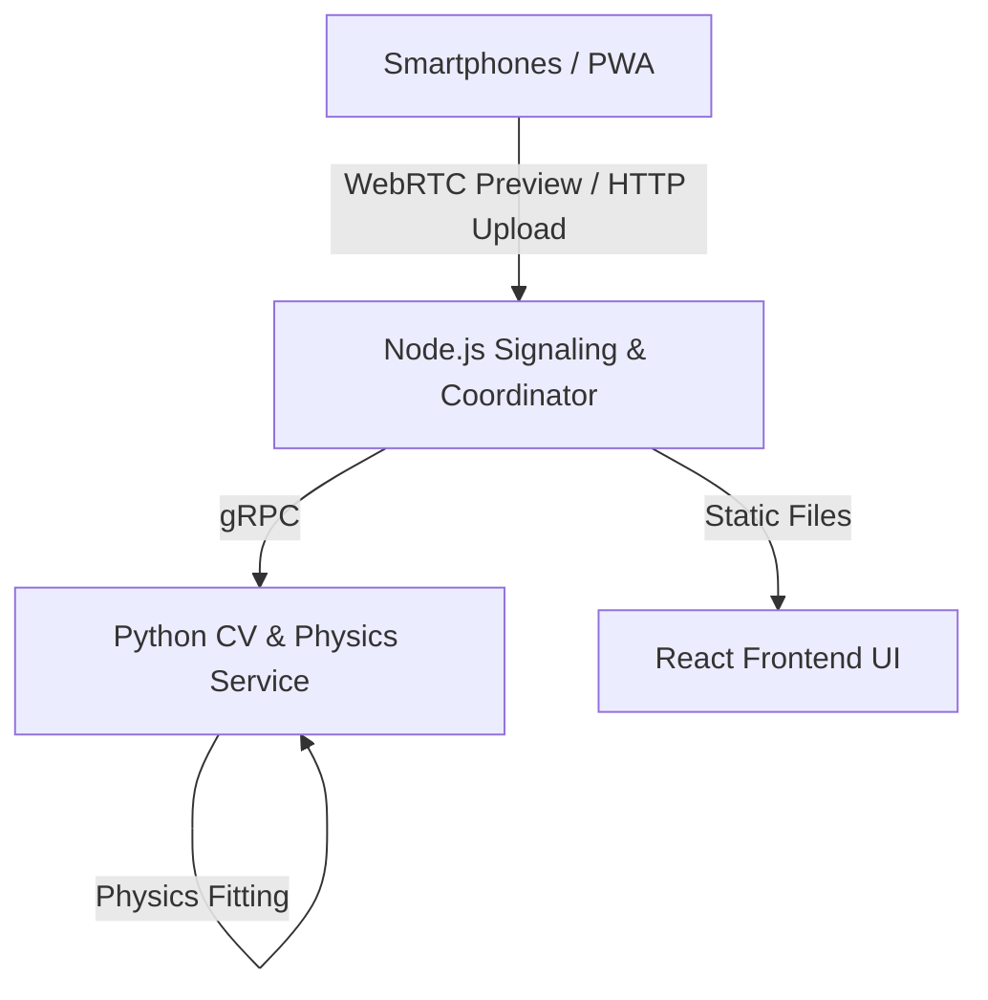

# PhysicsCapture

PhysicsCapture is a high-accuracy multi-camera motion analysis system designed for physics experiments, specifically optimised for tracking rolling ball collisions. It uses off-the-shelf smartphones as synchronised high-bitrate cameras and uses computer vision (Meta's SAM2) to reconstruct 3D trajectories and analyse momentum conservation.

## Key Features

- **Visual Metronome Synchronisation:** Achieves sub-frame (<0.5ms) temporal alignment across multiple independent devices.
- **High-Accuracy Tracking:** Uses Meta's **Segment Anything Model 2 (SAM2)** for robust object tracking, even with motion blur or partial occlusions.
- **Uncertainty Propagation:** All results (velocity, momentum, kinetic energy) include automatic uncertainty estimates derived from measurement errors.
- **PWA Camera Client:** No native app required—any smartphone with a modern browser can serve as a camera.
- **Lossless Processing:** Extract video frames into lossless PNG sequences for maximum tracking fidelity.

## System Architecture



## Prerequisites

- **Node.js:** 20.x or higher
- **Python:** 3.11.x or higher
- **FFmpeg:** Installed and available on your system `PATH` (used for frame extraction).
- **GPU (Recommended):** An NVIDIA GPU with CUDA support is highly recommended for SAM2 tracking performance, though it will fall back to CPU if unavailable.

## Installation

### 1. Clone the Repository

```bash
git clone https://github.com/oJezler-git/physics-capture.git
cd physics-capture
```

### 2. Install Node.js Dependencies (Frontend & Signaling)

From the project root:

```bash
npm install
```

_Note: This uses npm workspaces to install dependencies for both `packages/frontend` and `packages/signaling`._

### 3. Install Python Dependencies (CV Service)

I'd recommend using a virtual environment:

```bash
cd packages/cv-service
python -m venv .venv

# Windows
.venv\Scripts\activate
# macOS/Linux
source .venv/bin/activate

pip install -r requirements.txt
cd ../..
```

### 4. AI Models (SAM2)
The system uses Meta's `SAM2-hiera-large` model. The `cv-service` is configured to automatically download the necessary checkpoints from Hugging Face on the first run.

**Manual Setup (Offline Alternative):**
If the automatic download fails or you are working offline:
1. Download the checkpoint: [sam2.1_hiera_large.pt](https://dl.fbaipublicfiles.com/segment_anything_2/092824/sam2.1_hiera_large.pt).
2. Download the matching config: [sam2.1_hiera_l.yaml](https://github.com/facebookresearch/sam2/blob/main/sam2/configs/sam2.1/sam2.1_hiera_l.yaml).
3. Set the following environment variables before starting the CV service:
   - `SAM2_CHECKPOINT_PATH`: Full path to your `.pt` file.
   - `SAM2_CONFIG_FILE`: The name or path of the `.yaml` config file.


## Usage

To run the complete system (Frontend, Signaling, and CV Service) simultaneously with a single command:

```bash
npm run dev
```

This will start all three services in your current terminal with color-coded logs:
- **[blue]** Signaling Server
- **[green]** Frontend UI
- **[yellow]** CV gRPC Service

### Individual Service Commands
If you prefer to run them in separate terminals:
- **Signaling:** `npm run dev:signaling`
- **Frontend:** `npm run dev:frontend`
- **CV Service:** `npm run dev:cv`

Once all services are running, open your browser to `https://localhost:3000`.

*Note: The frontend uses a self-signed certificate for local HTTPS (required for WebRTC/Camera access). You may need to click "Advanced" -> "Proceed to localhost" in your browser.*

### Default Ports
- **Frontend:** `https://localhost:3000`
- **Signaling Server:** `http://localhost:3001`
- **CV gRPC Service:** `localhost:50051`

## Experimental Workflow

1.  **Setup Session:** Open the app on your laptop and smartphones. Scan the QR code on the phones to link them as camera devices.
2.  **Calibration:** Place a checkerboard in the field of view of all cameras to perform intrinsic and extrinsic (stereo) calibration.
3.  **Recording:**
    - Place the laptop so the screen (Visual Metronome) is visible in a corner of the camera frames.
    - Press **Record**. The phones will record locally at 100Mbps.
    - Roll the balls and capture the collision.
    - Press **Stop**. The UI will guide you through the processing phases:
        - **Uploading:** A progress bar shows the video being sent to the server.
        - **Extracting:** The server invokes `ffmpeg` to unpack the video into lossless PNG frames.
    - Once **Done** appears, click **Continue to Tracking**.
4.  **Tracking:**
    - Scrub to the first frame and click on the center of each ball (up to 3).
    - Click **Track**. SAM2 will propagate the masks through the entire sequence.
5.  **Results:** Review the velocity-time graphs and momentum conservation tables. Export data as CSV or PDF if needed.

## Repository Structure

- `packages/frontend`: React + Vite + TypeScript UI.
- `packages/signaling`: Node.js server for WebRTC signaling, file management, and `ffmpeg` orchestration.
- `packages/cv-service`: Python service implementing the SAM2 tracker, OpenCV calibration, and SciPy physics engine.
- `proto/`: Shared gRPC protocol definitions.
- `experiments/`: Local storage for recorded video, frames, and tracking results (gitignored).

## Development

- **Testing:**
  - Frontend: `npm run test:frontend`
  - Signaling: `npm run test:signaling`
  - CV Service: `npm run test:cv` (requires `pytest`)

## License

MIT
